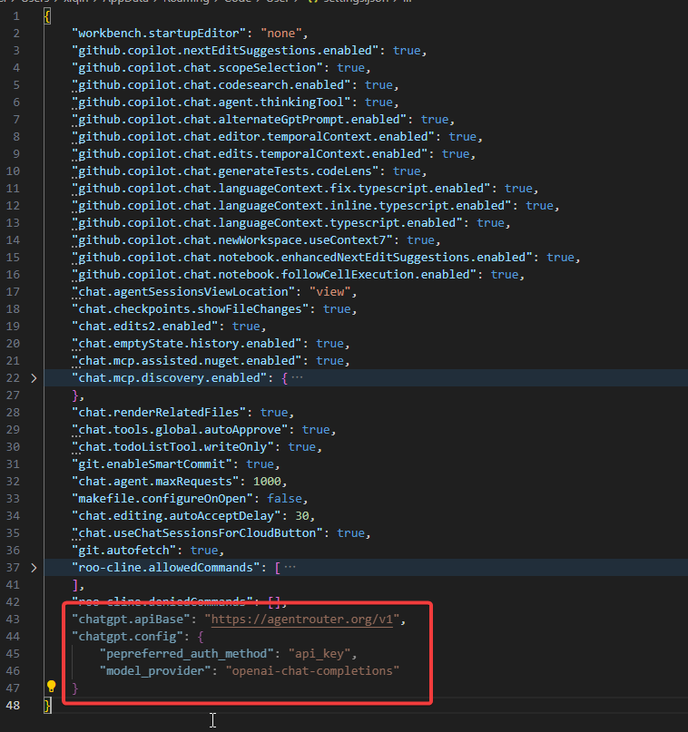

# 在 Codex 中使用 Agent Router

## 安装 Codex

::: code-group

```bash [pnpm]
pnpm install -g @openai/codex
```

```bash [npm]
npm install -g @openai/codex
```

```bash [yarn]
yarn global add @openai/codex
```

:::
## 配置环境变量

1. 访问  https://agentrouter.org/console/token ，获取你的 API Key
2. 设置系统环境变量,变量名为 `AGENT_ROUTER_TOKEN` ,值为你刚刚申请的值 （[环境变量设置教程](https://www.java.com/zh-CN/download/help/path.html)）
3. 创建 `~/.codex/config.toml` 文件，并添加如下配置

```toml
model = "gpt-5"
model_provider = "openai-chat-completions"
preferred_auth_method = "apikey"


[model_providers.openai-chat-completions]
name = "OpenAI using Chat Completions"
base_url = "https://agentrouter.org/v1"
env_key = "AGENT_ROUTER_TOKEN"
wire_api = "chat"
query_params = {}
stream_idle_timeout_ms = 300000

```

4. 创建 `~/.codex/auth.json` 文件，并在其中加入如下代码

```json
{
 "OPENAI_API_KEY":"这里换成你申请的 KEY"
}
```

::: tip
您可以将环境变量配置添加到您的系统环境变量中，避免每次手动设置：

::: code-group

```bash [Linux/macOS]
# 添加到 ~/.bashrc 或 ~/.zshrc 文件中
export AGENT_ROUTER_TOKEN="your-token-here"
```

```powershell [Windows PowerShell]
# 添加到 PowerShell 配置文件 ($PROFILE)
$env:AGENT_ROUTER_TOKEN="your-token-here"
```

```cmd [Windows CMD]
# 添加到系统环境变量中
set AGENT_ROUTER_TOKEN=your-token-here
# 或者通过系统属性设置永久环境变量
```

:::

:::

## 直接启动使用

配置好环境变量后，使用终端打开你要操作的项目目录，然后运行如下命令启动 Codex

```bash
# 进入项目目录
cd my-project

# 直接启动 OpenAI Codex
codex
```


## 在 VSCode 中的 Codex 中使用


1. 参考上面的说明安装 Codex ，并配置环境变量和配置文件。

2. 打开 VSCode，安装 [Codex 拓展](https://marketplace.visualstudio.com/items?itemName=openai.chatgpt)。

3. 进入设置,并点击右上角,切换为 JSON 配置模式


4. 添加如下配置项目


```json
"chatgpt.apiBase": "https://agentrouter.org/v1",
"chatgpt.config": {
    "pepreferred_auth_method": "api_key",
    "model_provider": "openai-chat-completions"
}
```




5. 点击 Codex 图标，开始使用