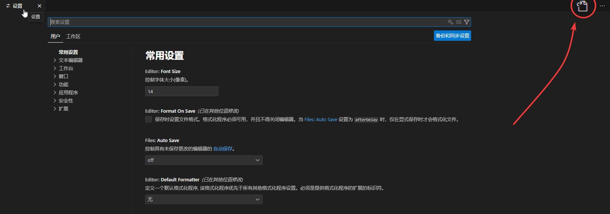

# Utiliser Agent Router avec Codex

## Installer Codex

::: code-group

```bash [pnpm]
pnpm install -g @openai/codex
```

```bash [npm]
npm install -g @openai/codex
```

```bash [yarn]
yarn global add @openai/codex
```

:::
## Configurer les variables d'environnement

1. Visitez https://agentrouter.org/console/token pour obtenir votre clé API
2. Définissez la variable d'environnement système avec le nom `AGENT_ROUTER_TOKEN` et la valeur que vous venez d'obtenir ([Tutoriel sur les variables d'environnement](https://www.java.com/zh-CN/download/help/path.html))
3. Créez le fichier `~/.codex/config.toml` et ajoutez la configuration suivante :

```toml
model = "gpt-5"
model_provider = "openai-chat-completions"
preferred_auth_method = "apikey"


[model_providers.openai-chat-completions]
name = "OpenAI using Chat Completions"
base_url = "https://agentrouter.org/v1"
env_key = "AGENT_ROUTER_TOKEN"
wire_api = "chat"
query_params = {}
stream_idle_timeout_ms = 300000

```

4. Créez le fichier `~/.codex/auth.json` et ajoutez le code suivant :

```json
{
 "OPENAI_API_KEY":"Remplacez par votre clé obtenue"
}
```

## Lancement direct

Après avoir configuré les variables d'environnement, utilisez le terminal pour ouvrir le répertoire de votre projet, puis exécutez la commande suivante pour démarrer Codex :

```bash
# Accéder au répertoire du projet
cd mon-projet

# Lancer OpenAI Codex directement
codex
```


## Utiliser Codex dans VSCode


1. Suivez les instructions ci-dessus pour installer Codex et configurer les variables d'environnement et les fichiers de configuration.

2. Ouvrez VSCode et installez l'[extension Codex](https://marketplace.visualstudio.com/items?itemName=openai.chatgpt).

3. Accédez aux paramètres et cliquez sur l'icône en haut à droite pour basculer en mode de configuration JSON.



4. Ajoutez les éléments de configuration suivants :


```json
"chatgpt.apiBase": "https://agentrouter.org/v1",
"chatgpt.config": {
    "pepreferred_auth_method": "api_key",
    "model_provider": "openai-chat-completions"
}
```


5. Cliquez sur l'icône Codex pour commencer à l'utiliser