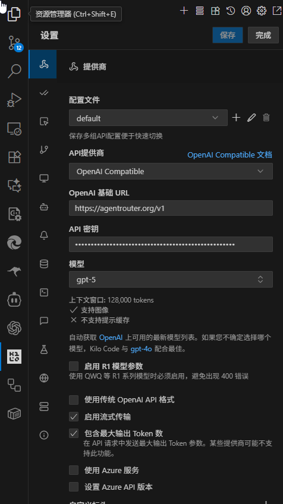

# Utiliser Agent Router avec Kilo Code

## Installer Kilo Code dans VSCode

1. Recherchez [Kilo Code](https://marketplace.visualstudio.com/items?itemName=kilocode.Kilo-Code) dans VSCode et installez-le.

2. Visitez https://agentrouter.org/console/token pour obtenir votre Clé API

## Ajouter un Fournisseur

Après avoir terminé l'installation de Kilo Code, vous pouvez ouvrir Kilo Code, sélectionner configurer le fournisseur, et ajouter un nouveau fournisseur Compatible OpenAI. Les éléments de configuration spécifiques peuvent être référencés :

- URL de Base OpenAI : `https://agentrouter.org/v1`
- Clé API : La Clé que vous avez créée sur https://agentrouter.org/console/token
- Modèle : `gpt-5`

Une fois la configuration terminée, sauvegardez et vous pouvez l'utiliser.

