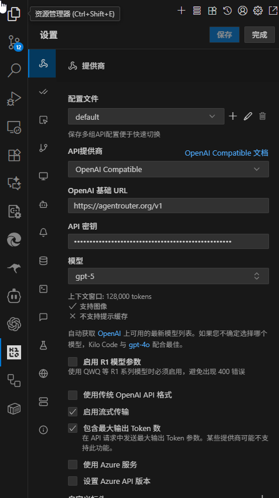

# 在 Kilo Code 中使用 Agent Router

## 在 VSCode 中安装 Kilo Code

1. 在 VScode 中搜索 [Kilo Code](https://marketplace.visualstudio.com/items?itemName=kilocode.Kilo-Code) 并安装。

2. 访问  https://agentrouter.org/console/token ，获取你的 API Key

## 新增提供商

完成 Roo Code 安装后，可以打开 Kilo Code，选择配置提供商，新增一个 OpenAI Compatible 的供应商，具体配置项可参考：

- OpenAI 基础 URL： `https://agentrouter.org/v1`
- API 密钥：你在  https://agentrouter.org/console/token  创建的 Key
- 模型： `gpt-5`, 也可以将其修改为 `glm-4.5`,`glm-4.6`,or `deepseek-v3.1` 等模型。

配置完成后，保存即可使用。

