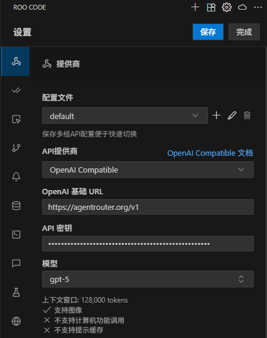

# Sử dụng Agent Router với Roo Code

## Cài đặt RooCode trong VSCode

1. Tìm kiếm [RooCode](https://marketplace.visualstudio.com/items?itemName=RooVeterinaryInc.roo-cline) trong VSCode và cài đặt.

2. Truy cập https://agentrouter.org/console/token để lấy API Key của bạn

## Thêm Provider

Sau khi hoàn tất cài đặt Roo Code, bạn có thể mở Roo Code, chọn configure provider, và thêm một OpenAI Compatible provider. Các mục cấu hình cụ thể có thể tham khảo:

- OpenAI Base URL: `https://agentrouter.org/v1`
- API Key: Key bạn đã tạo tại https://agentrouter.org/console/token
- Model: `gpt-5`

Sau khi hoàn tất cấu hình, lưu lại và bạn có thể bắt đầu sử dụng.

